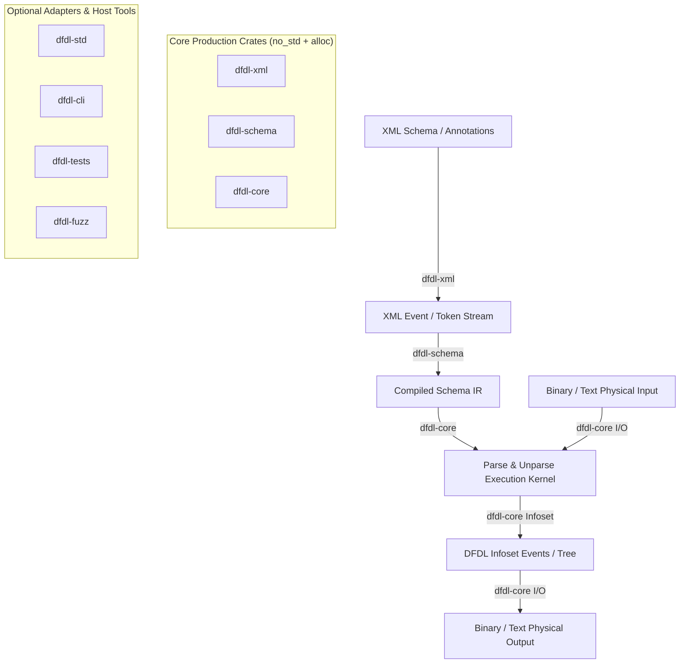

# ARCHITECTURE.md — DFDL Engine Architecture & Design Specification

## 1. System Overview

This engine is a production-oriented, panic-free Data Format Description Language (DFDL 1.0) parser, unparser, and schema compiler written in Rust for `#![no_std]` environments with `extern crate alloc`.

The architecture enforces strict separation of concerns across zero-dependency (or minimal `no_std` dependency) core crates and optional runtime/std host adapters.

## 2. Workspace Crate Boundaries

- **`dfdl-core`**: Core domain types, typed diagnostics (`DFDLError`), panic-free utilities, transactional bit/byte I/O streams, DFDL Infoset model, compiled schema IR execution kernel, property resolution rules, and basic expression evaluation.
- **`dfdl-xml`**: High-performance, streaming, panic-free XML parser operating under `#![no_std]` + `alloc`. Transforms raw byte streams into structured XML events with namespace resolution and precise source locations. Contains zero DFDL or XSD domain logic.
- **`dfdl-schema`**: XSD and DFDL schema compiler. Consumes XML events from `dfdl-xml`, builds XSD component graphs, resolves property inheritance and scoping, compiles DFDL expression strings, and outputs immutable `CompiledSchema` IR objects for `dfdl-core`.
- **`dfdl-std`**: Optional host library providing `std::io::Read`/`Write` adapters, filesystem schema resolvers, and standard error conversions.
- **`dfdl-cli`**: Command-line tool for schema compilation, data parsing, unparsing, and diagnostics formatting.
- **`dfdl-tests`**: Integration suite, specification test vectors, and conformance test runner.
- **`dfdl-fuzz`**: Fuzzing targets for XML parsing, schema compilation, expression parsing, and binary decoding.

## 3. Core Architectural Constraints & Rules

1. **Dependency Cycles**: Strictly prohibited. `dfdl-xml` does NOT depend on `dfdl-schema` or `dfdl-core`. `dfdl-core` does NOT depend on `dfdl-xml` or `dfdl-schema`. `dfdl-schema` depends on `dfdl-xml` and `dfdl-core`.
2. **`no_std` Isolation**: Core production crates (`dfdl-core`, `dfdl-xml`, `dfdl-schema`) MUST build cleanly for bare-metal targets such as `thumbv7m-none-eabi` without `std`.
3. **Panic Freedom**: All production routines MUST return `Result<T, E>`. Panics, indexing (`[]`), unwrap, expect, and unchecked math are forbidden.
4. **Allocation Boundaries**: Dynamic memory growth MUST use fallible `try_reserve` allocation or caller-managed fixed-capacity buffers.
