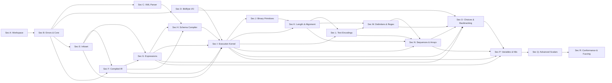

# SPEC_MAPPING.md — Normative Section to Implementation Module Mapping

## 1. Overview

This document explicitly maps every normative section of OGF GFD-R-P.240 (DFDL 1.0) and XML 1.0 specifications to their target crate, module, types, unit tests, and implementation phase.

## 2. Dependency-Ordered Roadmap & Section Mapping

### Section A — Specification Contract & Workspace Foundation
- **Normative Reference**: DFDL §§1–2, §§22–23
- **Dependencies**: None
- **Module Mapping**: Workspace root, `Cargo.toml`, `dfdl-core::spec`, build configurations
- **Target Verification**: Host target & `thumbv7m-none-eabi` cross-compilation check

### Section B — Core Vocabulary, Errors, Limits & Panic-Free Utilities
- **Normative Reference**: DFDL §3.1, §3.2, Appendix E, Appendix F, §9.1
- **Dependencies**: Section A
- **Module Mapping**: `dfdl-core::error`, `dfdl-core::limits`, `dfdl-core::types`, `dfdl-core::util`
- **Target Verification**: Checked numeric ops, fallible reservations, typed diagnostic structs

### Section C — Panic-Free XML Parser
- **Normative Reference**: XML 1.0, Namespaces in XML 1.0
- **Dependencies**: Section B
- **Module Mapping**: `dfdl-xml::parser`, `dfdl-xml::event`, `dfdl-xml::reader`
- **Target Verification**: Zero-copy XML tokenizer, streaming namespace stack, entity limits

### Section D — Transactional Bit and Byte I/O
- **Normative Reference**: DFDL §9.2
- **Dependencies**: Section B
- **Module Mapping**: `dfdl-core::io::source`, `dfdl-core::io::sink`, `dfdl-core::io::bitstream`
- **Target Verification**: Bit/byte readers/writers, checkpoints, transaction commit/rollback

### Section E — Typed Values and DFDL Infoset
- **Normative Reference**: DFDL §4, §5.1
- **Dependencies**: Section B, Section D
- **Module Mapping**: `dfdl-core::infoset::value`, `dfdl-core::infoset::events`, `dfdl-core::infoset::tree`
- **Target Verification**: Simple/complex infoset nodes, nil/empty/absent distinctions

### Section F — Compiled Schema Intermediate Representation
- **Normative Reference**: DFDL §§5–8 (Semantic level)
- **Dependencies**: Section B, Section E
- **Module Mapping**: `dfdl-core::schema::ir`, `dfdl-core::schema::builder`
- **Target Verification**: Graph validation, immutable term descriptors, reference cycle detection

### Section G — Property Resolution and Expression Engine
- **Normative Reference**: DFDL §6.3, §7, §8.1, §18
- **Dependencies**: Section B, Section E, Section F
- **Module Mapping**: `dfdl-core::expr::lexer`, `dfdl-core::expr::parser`, `dfdl-core::expr::eval`
- **Target Verification**: Path evaluation, checked math expressions, static type checking

### Section H — XSD/DFDL Schema Compiler
- **Normative Reference**: DFDL §5.2, §§6–8
- **Dependencies**: Section C, Section F, Section G
- **Module Mapping**: `dfdl-schema::compiler`, `dfdl-schema::xsd`, `dfdl-schema::resolver`
- **Target Verification**: XML event to schema IR compiler, property scoping, import resolver

### Section I — Bidirectional Execution Kernel
- **Normative Reference**: DFDL §9, §20
- **Dependencies**: Section D, Section E, Section F, Section G, Section H
- **Module Mapping**: `dfdl-core::kernel::parse_ctx`, `dfdl-core::kernel::unparse_ctx`, `dfdl-core::kernel::driver`
- **Target Verification**: State machine traversal, diagnostic enrichment, resource monitoring

### Section J — Fundamental Binary Primitive Codecs
- **Normative Reference**: DFDL §13 (Binary portions)
- **Dependencies**: Section I
- **Module Mapping**: `dfdl-core::codecs::binary_int`, `dfdl-core::codecs::binary_float`
- **Target Verification**: Big/little endian, signed/unsigned, bit-aligned primitives

### Section K — Position, Alignment, Length, Padding & Bounded Regions
- **Normative Reference**: DFDL §12
- **Dependencies**: Section G, Section I, Section J
- **Module Mapping**: `dfdl-core::kernel::alignment`, `dfdl-core::kernel::length`
- **Target Verification**: Nested bounded streams, skip bytes, length calculations

### Section L — Text Encodings and Scalar Text Representation
- **Normative Reference**: DFDL §§11–13 (Text portions)
- **Dependencies**: Section G, Section I, Section K
- **Module Mapping**: `dfdl-core::codecs::text`, `dfdl-core::encoding`
- **Target Verification**: ASCII, UTF-8, UTF-16, numeric text parsing/unparsing

### Section M — Delimiters, Escaping, and DFDL Regular Expressions
- **Normative Reference**: DFDL §§12–13, §19
- **Dependencies**: Section G, Section K, Section L
- **Module Mapping**: `dfdl-core::delimiters`, `dfdl-core::regex`
- **Target Verification**: Escape block/character processing, zero-alloc scanning

### Section N — Sequences, Groups, Optional Elements, and Arrays
- **Normative Reference**: DFDL §14, §16
- **Dependencies**: Section I, Section K, Section L, Section M
- **Module Mapping**: `dfdl-core::kernel::sequence`, `dfdl-core::kernel::array`
- **Target Verification**: Min/max occurs, separator suppression, progress checks

### Section O — Choices, Uncertainty, Assertions, and Discriminators
- **Normative Reference**: DFDL §9.3, §15, §7
- **Dependencies**: Section D, Section G, Section I, Section M, Section N
- **Module Mapping**: `dfdl-core::kernel::choice`, `dfdl-core::kernel::backtrack`
- **Target Verification**: Speculative execution, discriminators, rollback validation

### Section P — Defaults, Nils, Variables, Calculated Values & Hidden Groups
- **Normative Reference**: DFDL §9.4, §13, §16, §17, §7
- **Dependencies**: Section G, Section I, Section N, Section O
- **Module Mapping**: `dfdl-core::kernel::variables`, `dfdl-core::kernel::calculated`
- **Target Verification**: Element defaults, nil values, calculated inputs/outputs

### Section Q — Remaining Scalar and Optional DFDL Features
- **Normative Reference**: DFDL §§10–19, §23
- **Dependencies**: Sections A through P
- **Module Mapping**: `dfdl-core::codecs::bcd`, `dfdl-core::codecs::calendar`
- **Target Verification**: Packed decimals, calendar types, advanced facets

### Section R — Conformance, Interoperability, Security, and Hardening
- **Normative Reference**: DFDL §22, Appendix F
- **Dependencies**: Sections A through Q
- **Module Mapping**: `dfdl-tests::conformance`, `dfdl-fuzz`
- **Target Verification**: End-to-end fuzzing, TDML integration, security audits
